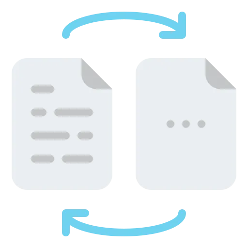

# Прохождение CTF-машины MD2PDF на TryHackMe

Прохождение CTF-машины под названием **MD2PDF**, размещённой на платформе TryHackMe. Несмотря на то, что уровень у машины "лёгкий", задача демонстрирует практическую уязвимость типа **SSRF (Server-Side Request Forgery)** и наглядно показывает, как без авторизации получить доступ к скрытым административным страницам.
