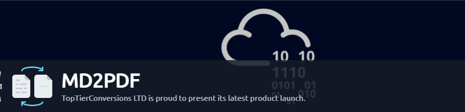
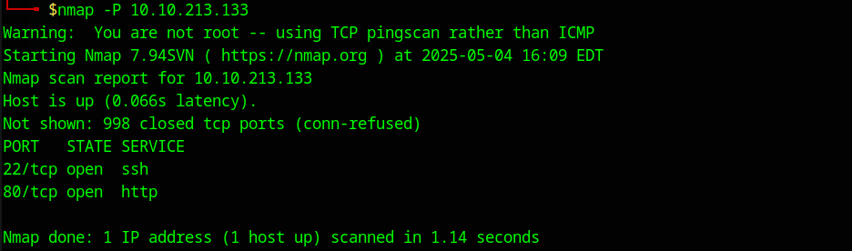
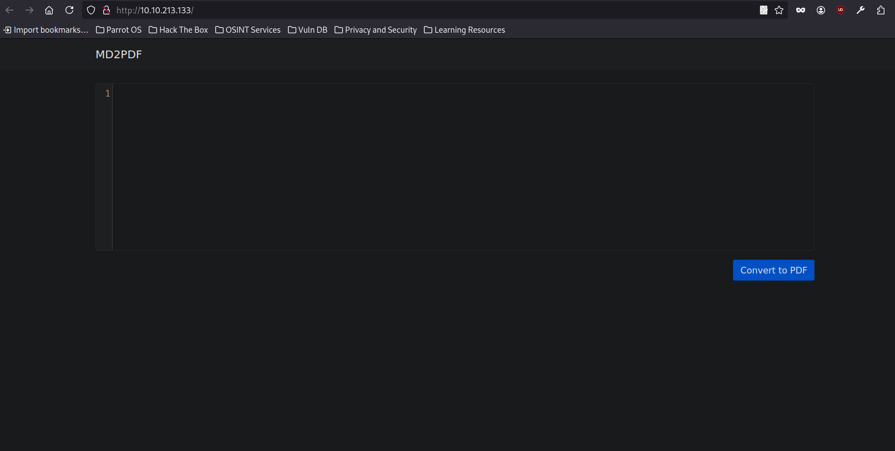
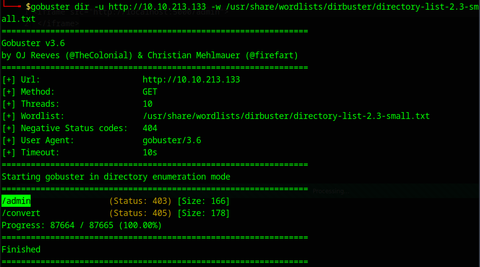
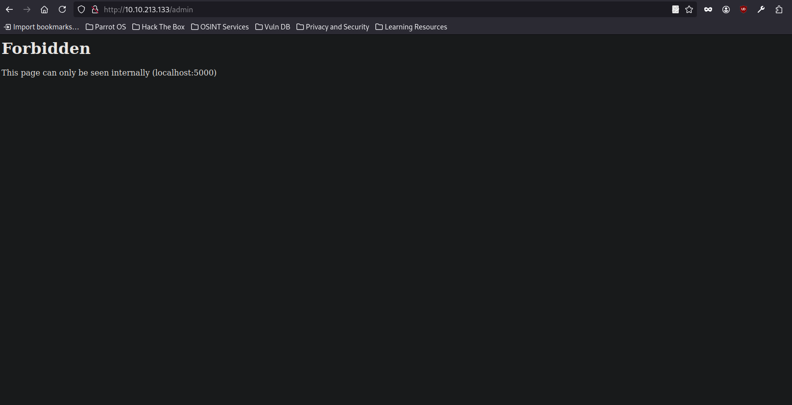
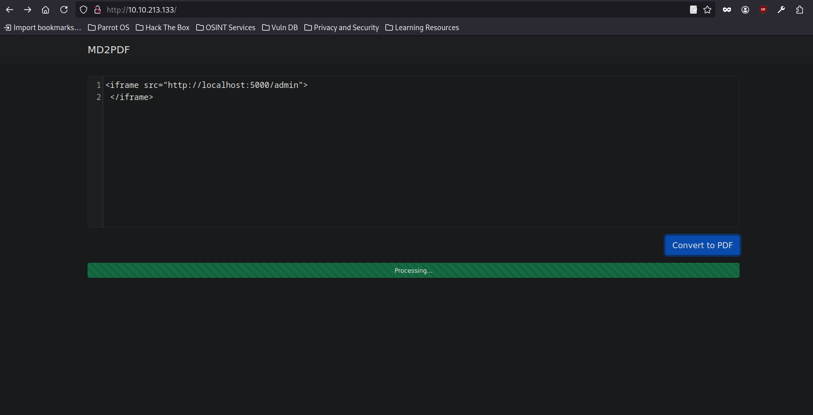
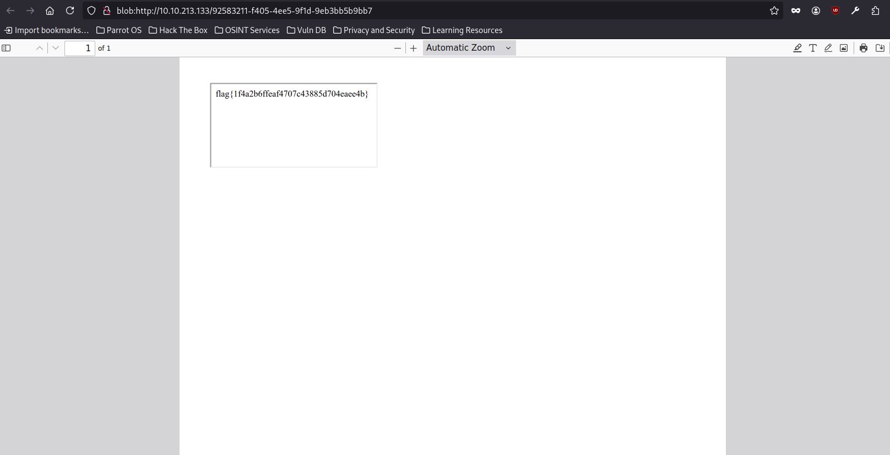

# Прохождение CTF-машины MD2PDF на TryHackMe



Прохождение CTF-машины под названием **MD2PDF**, размещённой на платформе TryHackMe. Несмотря на то, что уровень у машины "лёгкий", задача демонстрирует практическую уязвимость типа **SSRF (Server-Side Request Forgery)** и наглядно показывает, как без авторизации получить доступ к скрытым административным страницам.

Первым делом сканируем машину:

---

```nmap -P <IP_машины>```

---



Результат:

- 22/tcp - SSH (ничего интересного на этом этапе)

- 80/tcp - HTTP

На порту 80 работает веб-сервер. Открываем его в браузере и видим простой сервис, который конвертирует текст и изображения в PDF. В этот момент мы можем начать расследование, чтобы понять, какие уязвимости есть в веб-приложении.



На веб-сервере, работающем на порту 80, мы можем попытаться найти скрытые или защищённые страницы. Для этого используем инструмент ***Gobuster*** для перебора директорий:

---

```gobuster dir -u http://IP_машины -w /usr/share/wordlists/dirbuster/directory-list-2.3-small.txt```

---



В процессе сканирования обнаруживаем директорию **/admin**, но попытка доступа к ней возвращает статус **403 (Forbidden)**. Страница **/admin** выглядит как потенциальная скрытая административная панель, и это даёт нам повод для дальнейшего расследования.



Дальше мы обнаруживаем интересный момент: страница **/admin** доступна только через **localhost:5000**. Это ограничение предполагает, что доступ к странице ограничен для пользователей из внешней сети, и только сервер может обращаться к ней.

Однако, если запросы происходят на серверной стороне, ограничения могут быть минованы. Это и приводит нас к идее использовать iframe для обхода этого ограничения. Используя iframe, мы можем встраивать страницу, которая обращается к защищённой административной части веб-приложения, с внутренней сети.

---

```<iframe src="http://localhost:5000/admin"> </iframe>```

---



Когда мы вставили iframe в форму на сайте, мы дали команду серверу запросить страницу **/admin**, которая была доступна только для localhost(то есть только для самого сервера). Благодаря iframe, сервер теперь смог загрузить эту страницу, как если бы запрос был сделан с его стороны, а не с нашей.



После того как PDF-файл был сгенерирован, мы его открываем и видим флаг, который скрывался на странице **/admin**

Мы смогли получить доступ к этому флагу благодаря **SSRF** (Server-Side Request Forgery). Эта уязвимость позволяет обойти ограничения и запросить данные с внутренних страниц, которые обычно не доступны извне.
